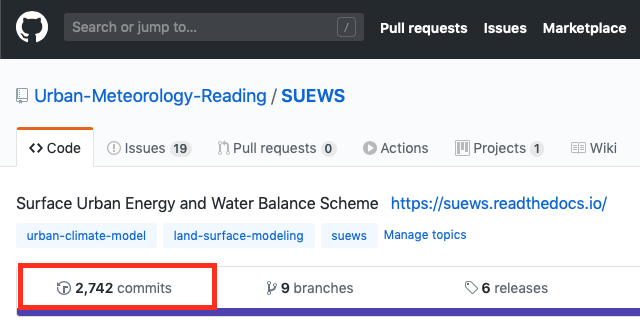

.. _asmnt1:

Assignment 1
============

.. #TODO: link to BB

.. #TODO: Links to other relevant materials

.. #TODO: remove to do notes down below

.. #TODO: Confirm all parts of a assignment are complete

.. #TODO: instructions on how to submit work via GitHub

General Objectives
------------------

#. To help prepare you for writing your thesis/dissertation. Therefore,
   you will prepare a paper in journal format (i.e. a research article, see :ref:`Paper`)
   rather than answering specific questions as you would in a more
   traditional assignment.
#. To analyse observational data using computer programmes.
#. To consider the magnitude of fluxes and energy balance closure.
#. To compare modelled and measured surface energy balance fluxes.
#. To prepare Python (or another computer language) programmes to
   complete this work (they should be submitted via :ref:`GitIn`
   and **referenced in your paper**)
#. To practise working in groups. You will undertake this in groups but
   independently write up and submit your own paper. Each member of the
   group will write computer programs, but you can work together to
   create common code to address all elements of this assignment.

This research paper should address
   #. Methods used to directly observe relevant surface fluxes and variables
   #. Methods used to obtain the fluxes from the observed data
   #. Determine surface parameters for your site (e.g. albedo, aerodynamic roughness parameters) to model the surface energy balance fluxes.
   #. Model the latent heat flux using Penman Monteith equation
   #. Evaluate the model performance (e.g. statistics, graphically) but also consider observational errors.
   #. Identify assumption made in your model (e.g. stability related, EBC)
   #. MT49E students: should also perform a sensitivity analysis of their model

To help you undertake this we provide some components `Tasks <Tasks.rst>`__

Assessment
-------------------------------------------

Do not forget to read through your paper and fix any `common mistakes <CommonMistakes.rst>`_

.. #TODO update this part

.. list-table::
   :header-rows: 1

   - * Percentage
     * Material
   - * 80 %
     * Scientific content
   - * 20%
     * Quality of presentation, including use of English and clarity of the report.

Format
-------------------

.. note::

   Read through your paper and fix any
   `common mistakes <CommonMistakes.rst>`__

-  Maximum Length of paper **12** sides/pages total (can be shorter).
-  Main Text – cannot be smaller than 10 pt.
-  References, Tables, Figure/Table Captions etc cannot be smaller than
   9 pt.
-  Python (or other language) codes do not count in the page limit, but
   a summary table (filename, description, etc.) is to be included in
   the page limit.
-  Python code to be submitted is via :ref:`GitIn`
-  A **summary table** should give the content and filename with
   a code that you refer to. You should refer to these in your methods.
-  **Each** student hands in an independent report (make certain your
   **student ID number** and which **module** you are enrolled in,
   *MT37J* or *MT49E*, is on it) and your programmes (e.g. python).
-  Although you will work in groups during the class, the write-up is to
   be your own work and written independently.
-  Please be careful of all forms of `plagiarism. <https://student.reading.ac.uk/essentials/_the-important-stuff/rules-and-regulations/plagiarism-rules-for-referencing.aspx>`_
-  The **structure** of your paper should follows
   `general requirements by a scientific paper <ScientificPaper.rst>`_.

-  Make certain you **read** journal articles, so you know what is
   expected.

.. _GitIn:

GitHub Classroom submission
----------------------------------------------------------------

This class uses GitHub Classroom (GHC) to disseminate and collect the tasks along the way within Assignment 1.
Given GHC essentially adopts the `GitHub-based workflow`_, students don't have to explicitly submit the homework/task:
the latest commit before deadline would be automatically considered as a timely submission.

To check if your commits are successfully submitted, please look into your ``Commits`` tab and see the details (red-squared example below):

.. _GitHub-based workflow: https://guides.github.com/introduction/flow/

