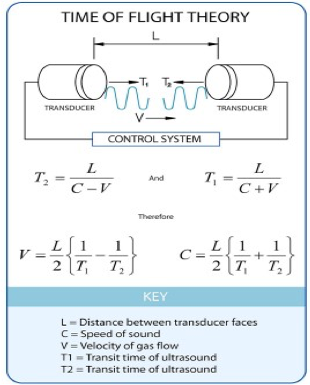
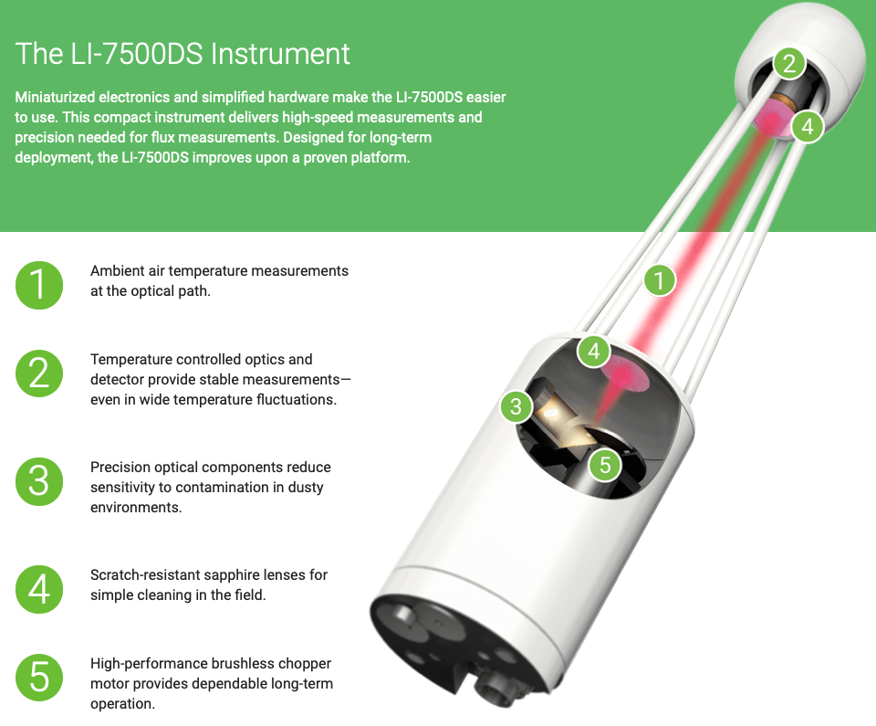
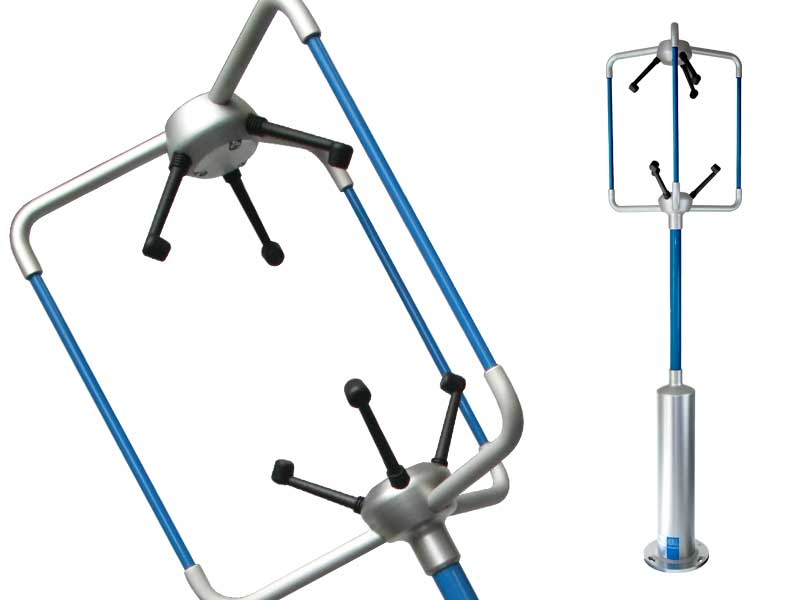

.. _EC:

Eddy Covariance
===============

Sonic Anemometer
----------------

A **sonic anemometer** derives the wind-speed from transit times of
acoustic pulses travelling in both directions along a fixed path. The
wind-speed component along the path is proportional to the difference
between the transit times. Three sets of transducer pairs are used to
derive the three components of the wind vector u, v, w. In addition, the
speed of sound can be deduced:

.. math::
    :label: v_sound

    c^2=403T_s,

where `T_s` is the sonic temperature:

.. math::
    :label: t_sonic

    T_s=T(1+0.32 e/p)

where `T` is the dry bulb temperature, `e` is the water vapour pressure, and
`p` is the air pressure. The sonic temperature is approximately equal to
the virtual temperature :math:`T_v`.

In practical use, the covariance:
:math:`\overline{w^{\prime} T_{s}^{\prime}} \approx \overline{w^{\prime} T^{\prime}}`
and therefore the sonic anemometer can be used to estimate turbulent
sensible heat flux (:math:`Q_H`). Sonic anemometers are the standard
instrument used to observe turbulence in the atmospheric boundary layer.

    Principle behind sonic measurement of velocity and speed of sound

Infra-red Gas Analyser (IRGA)
-----------------------------

IRGA allows measurement of variations in water vapour and carbon dioxide
allowing the latent heat flux and carbon dioxide to be measured.
The specific humidity of water vapour `q` is expressed in units of kg |kg^-1|.
The absolute humidity (kg |m^-3|) is derived by taking the molecular weight of water into account (1 mol = 18 g = 0.018 kg)
and similarly for carbon dioxide concentrations (molar mass 44 g mol\ :sup:`-1`).

#. Open-path IRGA: Measurements are made at station pressure.
#. Closed-path IRGA: Air is sucked down a tube into the instrument
   itself

    Schematic of the LI-COR Li 7500 open path infra-red gas analyser (IRGA) (source: `LI-COR <https://www.licor.com/env/products/eddy_covariance/LI-7500DS.html>`_)

Instruments at Different Sites
~~~~~~~~~~~~~~~~~~~~~~~~~~~~~~

    Campbell Scientific CSAT3 sonic anemometer with Li-7500, Kipp and Zonen CNR3 net radiometer, and Vaisala WXT520 weather station in between (source: `Gill Instruments <http://www.gillinstruments.com/new-images/applications/sonic-anemometer/sonic-anemometer-1.jpg>`_).

#. Site: URAO

    -  see `Observatory <Observatory.rst>`__.

#. Site: AmeriFlux

    - Each site has a key reference that gives the details of the
      instruments used.
    - Please see `this AmeriFlux page <https://ameriflux.lbl.gov/sites/site-search/>`_ for details (login required with free registration).

Eddy covariance (EC) method to measure fluxes
---------------------------------------------

.. note::
    `\tau` unfortunately (by convention) is used for
    both momentum and time lag

EC is regarded as the standard method to measure fluxes as it quantifies
directly the contribution by each eddy. EC fluxes of momentum, heat and
moisture require fast response (10-20 Hz) measurements to capture the
scales of turbulence contributing to fluxes. The momentum flux (or
Reynolds stress) is calculated from:

.. math::
    :label: tau

    \tau=\rho \sqrt{\left(\overline{u^{\prime} w^{\prime}}^2
    +\overline{v^{\prime} w^{\prime}}^2\right)}

This considers any vertical transfer of lateral momentum
:math:`\overline{u^{\prime} w^{\prime}}`.
The sensible heat flux is given by:

.. math::
    :label: qh

    Q_{H}=\rho c_{p} \overline{w^{\prime} T^{\prime}}

assuming that :math:`T\approx \theta` , and the latent heat flux
(:math:`Q_E` ) is given by:

.. math::
    :label: qe

    Q_{E}=L_{V} \overline{w^{\prime}} q^{\prime}

where :math:`L_{V}` is the latent heat of vaporisation
(:math:`\approx 2.45 \times 10^6 \text{kg}^{-1}`)
and q is the specific humidity.
These equations assume the vertical component of the flux dominates,
i.e. flow is homogeneous and steady.

Rotation of EC data
-------------------

In theory, the wind component u is defined as being aligned with the
mean wind direction, and thus the mean vertical component. The
instrument itself has a fixed frame of reference, so how is this
achieved? The frame of reference is rotated to align the new u axis with
the measured mean wind vector.

This is called double rotation as it is
usually done in two steps:

1. rotate through angle `\alpha` around the vertical axis so that;
2. rotate through angle `\beta` around the lateral axis so that.

Mathematically this is given by:

.. math::
    :label: rot_mat

    \begin{aligned}
    \left[
    \begin{array}{c}{u_{2}} \\ {v_{2}} \\ {w_{2}}\end{array}
    \right]=
    \left[
    \begin{array}{ccc}{\cos \alpha \cos \beta} & {\sin \alpha \cos \beta} & {\sin \beta}
    \\ {-\sin \alpha} & {\cos \alpha} & {0}
    \\ {-\cos \alpha \sin \beta} & {-\sin \alpha \sin \beta} & {\cos \beta}\end{array}\right]
    \times
    \left[\begin{array}{c}
        {\overline{u}}
    \\ {\overline{v}}
    \\ {\overline{w}}
    \end{array}
    \right]
    \end{aligned}

where :math:`\alpha=\tan ^{-1}(\overline{v} / \overline{u})` and
:math:`\beta=\tan ^{-1}(\overline{w} / \sqrt{\overline{u}^{2}+\overline{v}^{2}})`.

Co-ordinate transformation of wind components
---------------------------------------------

It is not generally possible to mount a 3-directional anemometer so that
its axes coincide with the directions
`\overline{u}>0, \overline{v}=0, \overline{w}=0`
(where the over-bar denotes time-averaging over many data values).
However, a co-ordinate transformation applied to the sensed components
`U, V, W` means that the transformed component series `u, v, w`
satisfies the above properties.
The transformed components can be calculated using

.. math::
    :label: rot_wind

    \begin{aligned}
    \begin{array}{l}
    {u=U \cos A \cos B+V \cos A \sin B+w \sin A} \\
    {v=V \cos B-U \sin B} \\
    {w=W \cos A-U \sin A \cos B-V \sin A \sin B}
    \end{array}
    \end{aligned}

where angle :math:`A=\arctan{(\overline{W}/S)}`,
:math:`\sin B=\overline{V}/S`, :math:`\sin B=\overline{U}/S` ,
:math:`S=\overline{U}^2+\overline{V}^2`.

Errors in statistics
--------------------

Reynolds averaging requires separation into a *mean* part (low frequency
variation) and *fluctuations* (high frequency) from which we calculate
covariances, variances, etc which are all in some sense a mean value
taken over many samples.
Usually we calculate the *standard error of a mean*.

.. math::
    :label: delta_a

    \Delta_{\alpha} = \sigma_{\alpha}/\sqrt{N}

where `N` is the number of samples taken. In turbulence, we know that each
discrete measurement – or sample – is not fully independent of the last
one, and the number of samples which are correlated is determined by the
**integral time-scale** *LT*. So N should be replaced by the
*number of independent samples*:

.. math::
    :label: n_ind

    N_{i} = T/L_{T}

where `T` is the period over which data is being averaged.

Statistical *stationarity* of a time series means that variances and
covariances approach a stable value as the averaging time is extended,
and the errors associated get smaller. So *how long is long enough*?
The aim is to have a large number of samples.

So given that the averaging period `T = N\Delta t`,
there is a trade-off between the sampling period and the interval
between samples, `\Delta t`. If `\Delta t` is too long, then `T` must be
increased to keep `N` large. The danger is that *T* is too long, and the
statistics are no longer stationary, i.e. the turbulent flow has changed
in response to external factors like a gust front passing through.
Typically, sampling rate is 10-20 Hz, and the averaging period is 30-60
minutes depending on conditions.

The autocorrelation function and integral timescale
---------------------------------------------------

As well as calculating the covariance between two variables, it is
instructive to look at the *auto-correlation function*, or the
correlation of a variable with itself at later time-steps. For instance,
consider the *u* component of the wind

.. math::
    :label: auto_u

    R_{u}(\tau) = \frac{\overline{u^{'}(t)u^{'}(t + \tau)}}{{\sigma_{u}}^{2}}

Hence `R(\tau)=1` at `\tau = 0`. The rate at which `R(\tau)` decreases with lag
is related to the *size distribution* of eddies. Large eddies cause
slower variations in the time series, and thus the auto-correlation will
decrease more slowly with lag than for a time series dominated by
smaller eddies. Hence, a simple measure of ‘typical eddy size’ is given
by the integral timescale `L_T` , defined as

.. math::
    :label: lt

    L_{T} = \int_{0}^{\infty}{R(\tau)\text{dτ}}

From Taylor’s frozen turbulence hypothesis, the integral length-scale
`L_X =\overline{u}L_T`. The integral length-scale for a variable can be thought
of as the *decorrelation length-scale*,
i.e. for *two sensors separated* beyond this distance,
the turbulence measured at each will
not be correlated.

Calculation of errors on covariances
------------------------------------

For a covariance (e.g. :math:`\overline{w'T'})\ ` the error can be
calculated: As :math:`\overline{w'T'}` is a mean of a large number of
quantities, we might expect its standard error to be given by:

.. math::
    :label: cov_t

    \Delta\overline{T^{'}w^{'}} = \sigma(T^{'}w^{'})/\sqrt{N_{i}}

where :math:`\sigma(T^{'}w^{'})` is the standard deviation of
:math:`\sigma(T^{'}w^{'})` and *Ni* is the number of independent
samples. Assuming all samples are independent of each other, estimate
the standard error :math:`\Delta\overline{T^{'}w^{'}}`.
*Is this likely to be an accurate estimate?*
The number of independent samples is more accurately given by:

.. math::
    :label: n_ind_t

    N_{i} = N\frac{\Delta t}{L_{t}},

where `N` is the total number of samples, `\Delta t` is the time between
samples and `L_t`, is the integral timescale for the time series of
:math:`T^{'}w^{'}`. To estimate the integral timescale, we need to
calculate and plot the autocorrelation function for :math:`T^{'}w^{'}`,
and read off the time at which it falls to `1/e = 0.368`.

